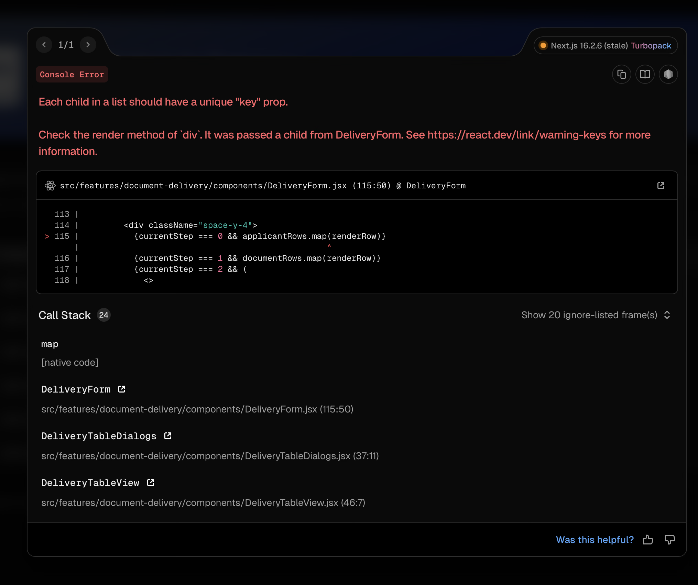

# Instalación del Captahuellas en una PC nueva (Windows)

Guía completa para dejar funcionando el lector de huellas Futronic FS88H
con la app SAIME en una máquina Windows 10/11 desde cero.

> El puente (`bridge.py`) y el binario (`futronic-capture.exe`) se ejecutan
> en la **misma PC** donde está conectado el escáner. El navegador de esa
> PC se conecta al puente por `127.0.0.1` (sin abrir puertos en el firewall).

---

## Actualizar una instalación existente (ej: agregar soporte FS64)

Para PCs donde ya se corrió `install.bat` con una versión anterior del
paquete (sin `finger_crop.py` ni `Pillow`):

1. Copiar el paquete nuevo a la PC (mismo zip, regenerado).
2. Doble clic en `package\windows\update.bat`.
3. Listo: detiene watchdog y puente, reemplaza `bridge.py` y agrega
   `finger_crop.py`, instala `Pillow` vía pip y relanza el puente.
   **No toca** certificados, `.env.bridge` ni el acceso de auto-inicio.

> Alternativa manual (solo si no se puede re-empaquetar): copiar
> `bridge.py`, `finger_crop.py` y `requirements.txt` a
> `%APPDATA%\SAIME\FingerprintBridge\`, luego:
> `taskkill /F /IM wscript.exe`, después
> `python -m pip install -r "%APPDATA%\SAIME\FingerprintBridge\requirements.txt"`
> y re-arrancar el watchdog con
> `start "" wscript.exe "%APPDATA%\SAIME\FingerprintBridge\bridge-watchdog.vbs"`.

## 1. Conectar el escáner e instalar el driver

1. Conectar el escáner **FS88H** por USB.
2. Descargar el driver oficial Futronic desde
   `https://www.futronic-tech.com/download/` (driver para FS80/88/90,
   `ftrDriverSetup` para Windows 8/10/11).
   > Si el escáner es un **FS64** (tenprint livescan), usar el driver que
   > Futronic indique para ese modelo; el puente lo detecta automáticamente
   > y recorta el dedo para la captura (requiere `Pillow`, incluido en
   > `requirements.txt`).
3. Ejecutar el instalador **como administrador** y conectar/reconectar el
   escáner cuando lo pida.
4. Verificar en **Administrador de dispositivos**:
   - No debe aparecer con ⚠ error (código 28 / `CM_PROB_FAILED_INSTALL`).
   - Si aparece error: desinstalar el dispositivo, ejecutar de nuevo el
     setup del driver y reconectar el cable.

> Sin driver funcionando, el binario responderá `ERROR: open` y la app
> mostrará "Lector desconectado".

## 2. Instalar el puente (bridge)

1. Copiar el paquete (contenido de la carpeta `package/` del zip
   `saime-fingerprint-bridge.zip`) a la PC, por ejemplo:
   `C:\SAIME\FingerprintBridge\`.
2. Ejecutar `install.bat` desde `package\windows\` (doble clic):
   - En producción (página HTTPS): `install.bat --origin=https://<dominio-app>`
   - En desarrollo/prueba: `install.bat` a secas.
3. El instalador hace todo lo demás automáticamente:
   - Instala Python 3.11+ (vía winget) si no está en PATH.
   - Instala dependencias (`pip install -r requirements.txt`).
   - Copia bridge, binario y DLL a `%APPDATA%\SAIME\FingerprintBridge\`.
   - Genera el certificado TLS para `wss://` y lo agrega al almacén de
     **entidades de certificación raíz del usuario** (necesario si la app
     corre por HTTPS).
   - Crea el acceso directo de **auto-inicio** (`saime-bridge.vbs` en la
     carpeta Inicio), para que el puente arranque en cada login.

## 3. Arrancar el puente

- **Automático (recomendado)**: `install.bat` arranca el puente al final de
  la instalación mediante un **watchdog** (`bridge-watchdog.bat`) que:
  - Lo inicia en segundo plano sin ventanas.
  - Lo **relanza solo si se cae** (reinicio automático cada 3 s).
  - Arranca también en **cada inicio de sesión** (acceso directo en la
    carpeta Inicio).
- El registro de actividad queda en `%APPDATA%\SAIME\FingerprintBridge\bridge.log`.
- Manual (solo diagnóstico):
  ```cmd
  python "%APPDATA%\SAIME\FingerprintBridge\bridge.py"
  ```
  > Si lo lanzas manualmente con el watchdog activo, chocará con el puerto
  > (el watchdog ya tiene una instancia corriendo). Detén el watchdog con
  > `taskkill /F /IM wscript.exe` antes de probar a mano.

El puente escucha en:
- `ws://127.0.0.1:3003` — siempre disponible.
- `wss://127.0.0.1:3002` — cuando hay certificados TLS.

## 4. Verificar la instalación

Ejecutar `test-windows.bat` (incluido en el paquete). Comprueba:

- Python y paquete `websockets`.
- `futronic-capture.exe` + `ftrScanAPI.dll` presentes y ejecutables.
- Puerto 3002 libre.
- Arranque del bridge (smoke test de 5 segundos).
- Certificado TLS y auto-inicio configurados.

Prueba rápida del escáner (con el puente detenido):
```cmd
cd /d "%APPDATA%\SAIME\FingerprintBridge"
futronic-capture.exe
```
Debe imprimir `Place finger...` y, al colocar el dedo, `GetImage OK (dose N)`.

## 5. Conectar con la app web

- Abrir la app en el navegador **de la misma PC**.
- El frontend detecta automáticamente el puerto correcto según el protocolo:
  - Página `http://` → `ws://127.0.0.1:3003`
  - Página `https://` → `wss://127.0.0.1:3002`
- Si la página es HTTPS y el navegador no confía en el certificado del
  puente, volver a ejecutar `install.bat` (lo importa al almacén raíz del
  usuario).

## Solución de problemas

| Síntoma | Causa probable | Solución |
|---|---|---|
| `ERROR: open` al ejecutar el binario | Driver no instalado | Sección 1 |
| App muestra "Lector desconectado" | Puente no corriendo | Sección 3 |
| Error de TLS en consola (HTTPS) | Certificado no confiado | Re-ejecutar `install.bat` |
| `futronic-capture.exe` no ejecuta | Falta DLL junto al exe | Re-ejecutar `install.bat` |
| Huella muy oscura/clara | Dosis de exposición | Crear `.env.bridge` en `%APPDATA%\SAIME\FingerprintBridge\` con `FTR_DOSE=1..7` (2 es el valor medio) y reiniciar el puente |
